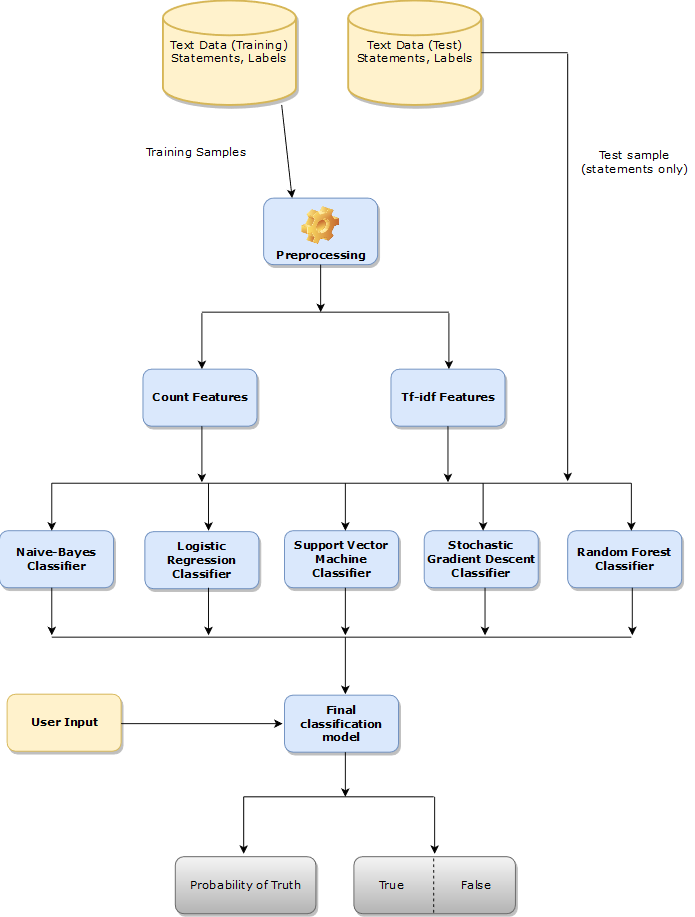
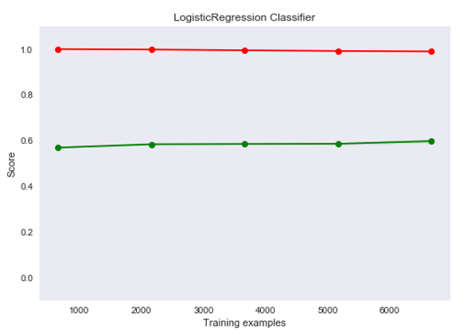
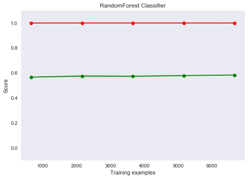

# Fake News Detection

Fake News Detection in Python

In this project, we have used various natural language processing techniques and machine learning algorithms to classify fake news articles using sci-kit libraries from python. 

## Getting Started

These instructions will get you a copy of the project up and running on your local machine for development and testing purposes. See deployment for notes on how to deploy the project on a live system.

## Project Flow<br/>


### Prerequisites

What things you need to install the software and how to install them:

1. Python 3.6 
   - This setup requires that your machine has python 3.6 installed on it. you can refer to this url https://www.python.org/downloads/ to download python. Once you have python downloaded and installed, you will need to set up PATH variables (if you want to run python program directly, detail instructions are below in the *how to run software section*). To do that check this: https://www.pythoncentral.io/add-python-to-path-python-is-not-recognized-as-an-internal-or-external-command/.  
   - Setting up the PATH variable is optional as you can also run the program without it and more instructions are given below on this topic. 
2. Second and easier option is to download anaconda and use its anaconda prompt to run the commands. To install anaconda check this URL https://www.anaconda.com/download/
3. You will also need to download and install the below 3 packages after you install either python or anaconda from the steps above
   - Sklearn (scikit-learn)
   - NumPy
   - scipy
   
  - if you have chosen to install python 3.6 then run the below commands in the command prompt/terminal to install these packages
   ```
   pip install -U scikit-learn
   pip install numpy
   pip install scipy
   ```
   - if you have chosen to install anaconda then run the below commands in the anaconda prompt to install these packages
   ```
   conda install -c scikit-learn
   conda install -c anaconda numpy
   conda install -c anaconda scipy
   ```   

#### Dataset used
The data source used for this project is the LIAR dataset which contains 3 files in .tsv format for the test, training, and validation. Below is some description about the data files used for this project.
	
LIAR: A BENCHMARK DATASET FOR FAKE NEWS DETECTION

William Yang Wang, "Liar, Liar Pants on Fire": A New Benchmark Dataset for Fake News Detection, to appear in Proceedings of the 55th Annual Meeting of the Association for Computational Linguistics (ACL 2017), short paper, Vancouver, BC, Canada, July 30-August 4, ACL.

the original dataset contained 13 variables/columns for train, test and validation sets as follows:

* Column 1: the ID of the statement ([ID].json).
* Column 2: the label. (Label class contains: True, Mostly-true, Half-true, Barely-true, FALSE, Pants-fire)
* Column 3: the statement.
* Column 4: the subject(s).
* Column 5: the speaker.
* Column 6: the speaker's job title.
* Column 7: the state info.
* Column 8: the party affiliation.
* Column 9-13: the total credit history count, including the current statement.
* 9: barely true counts.
* 10: false counts.
* 11: half-true counts.
* 12: mostly true counts.
* 13: pants on fire counts.
* Column 14: the context (venue / location of the speech or statement).

To make things simple we have chosen only 2 variables from this original dataset for this classification. The other variables can be added later to add some more complexity and enhance the features.

Below are the columns used to create 3 datasets that have been used in this project
* Column 1: Statement (News headline or text).
* Column 2: Label (Label class contains: True, False)
 
You will see that the newly created dataset has only 2 classes as compared to 6 from the original classes. Below is a method used for reducing the number of classes.

* Original 	--	New
* True	   	--	True
* Mostly-true	-- 	True
* Half-true	-- 	True
* Barely-true	-- 	False
* False		-- 	False
* Pants-fire	-- 	False

The dataset used for this project was in CSV format named train.csv, test.csv, and valid.csv and can be found in the repo. The original datasets are in "liar" folder in tsv format.


### File descriptions

#### DataPrep.py
This file contains all the pre-processing functions needed to process all input documents and texts. First, we read the train, test, and validation data files then performed some pre-processing like tokenizing, stemming, etc. There are some exploratory data analyses is performed like response variable distribution and data quality checks like null or missing values etc.

#### FeatureSelection.py
In this file, we have performed feature extraction and selection methods from sci-kit learn python libraries. For feature selection, we have used methods like simple bag-of-words and n-grams and then term frequency like tf-tdf weighting. we have also used word2vec and POS tagging to extract the features, though POS tagging and word2vec has not been used at this point in the project.

#### classifier.py
Here we have built all the classifiers for predicting fake news detection. The extracted features are fed into different classifiers. We have used Naive-bayes, Logistic Regression, Linear SVM, Stochastic gradient descent, and Random forest classifiers from sklearn. Each of the extracted features were used in all of the classifiers. Once fitting the model, we compared the f1 score and checked the confusion matrix. After fitting all the classifiers, 2 best-performing models were selected as candidate models for fake news classification. We have performed parameter tuning by implementing GridSearchCV methods on these candidate models and chosen best performing parameters for these classifiers. Finally selected model was used for fake news detection with the probability of truth. In Addition to this, We have also extracted the top 50 features from our term-frequency tfidf vectorizer to see what words are most and important in each of the classes. We have also used Precision-Recall and learning curves to see how training and test set performs when we increase the amount of data in our classifiers.

#### prediction.py
Our finally selected and best-performing classifier was ```Logistic Regression``` which was then saved on disk with the name ```final_model.sav```. Once you close this repository, this model will be copied to the user's machine and will be used by the prediction.py file to classify the fake news. It takes a news article as input from the user then the model is used for final classification output that is shown to the user along with the probability of truth.

Below is the Process Flow of the project:

### Performance
Below are the learning curves for our candidate models. 

**Logistic Regression Classifier**<br/>



**Random Forest Classifier**<br/>



### Next steps
As we can see that our best performing models had an f1 score in the range of 70s. This is due to the less number of data that we have used for training purposes and the simplicity of our models. For future implementations, we could introduce some more feature selection methods such as POS tagging, word2vec, and topic modeling. In addition, we could also increase the training data size. We will extend this project to implement these techniques in the future to increase the accuracy and performance of our models.
### Common Error 
if during the execution you have the error : ModuleNotFoundError: No module named 'sklearn.linear_model._logistic'
try executing the command :
pip3 install "scikit_learn==0.22.2.post1"
### Interface

<br/>


### executing the application 
python app.py


